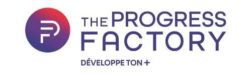
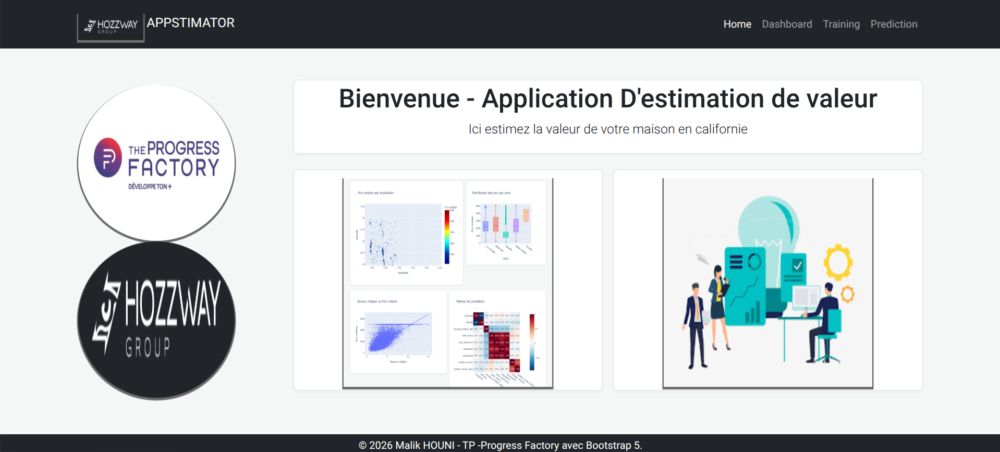
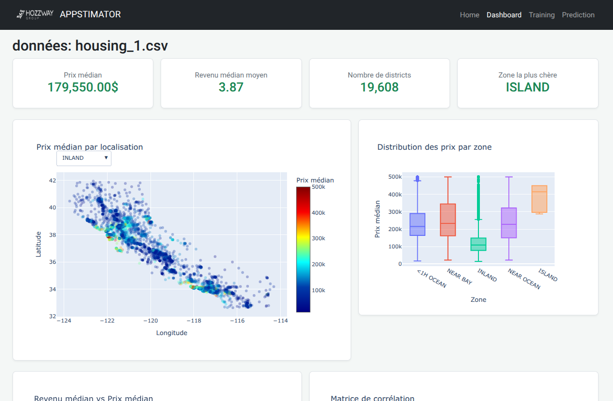
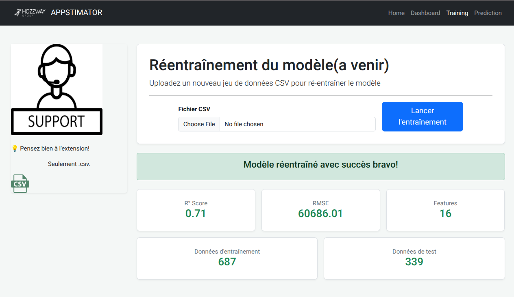

# TP Machine learning et Flask - 2026 - Par Malik HOUNI pour Progess Factory
### Prof: Baptiste

---
## 🎯 Objectif: Création d'un dashboard interactif avec Python, et Flask
---
Comment utiliser(en local):

décompresser l'archive ensuite:
```
c:/home:~$ cd project_ml
c:/home/project_ml:~$ python -m venv .venv
c:/home/project_ml:~$ source .venv/bin/activate
(.venv)c:/home/project_ml:~$ pip install -r requirements.txt
(.venv)c:/home/project_ml:~$ python app.py
```
ensuite aller voir à **l'url dans le browser:127.0.0.1:5000**
### Partie 1: Machine Learning
- ingestion des données et nettoyages
- E.D.A
- Feature engineering
- création de modèle de machine learning
- modèle testé et entrainé
- choix des features les plus important
- export et réutilisation du **modèle généré** avec Joblib
### Partie 2: Création de l'interface Web
technos: 
- Flask
- Python
    - Plotly (visualisation)
---
### Partie 3: Re-entrainement de model
## Possibilité de re entrainer un model en donnant un dataset différent
---
### Page web HOME:


---
### Page web DASHBOARD:


---
### Page web TRAINING:


---
### Page web PREDICTION:


---

